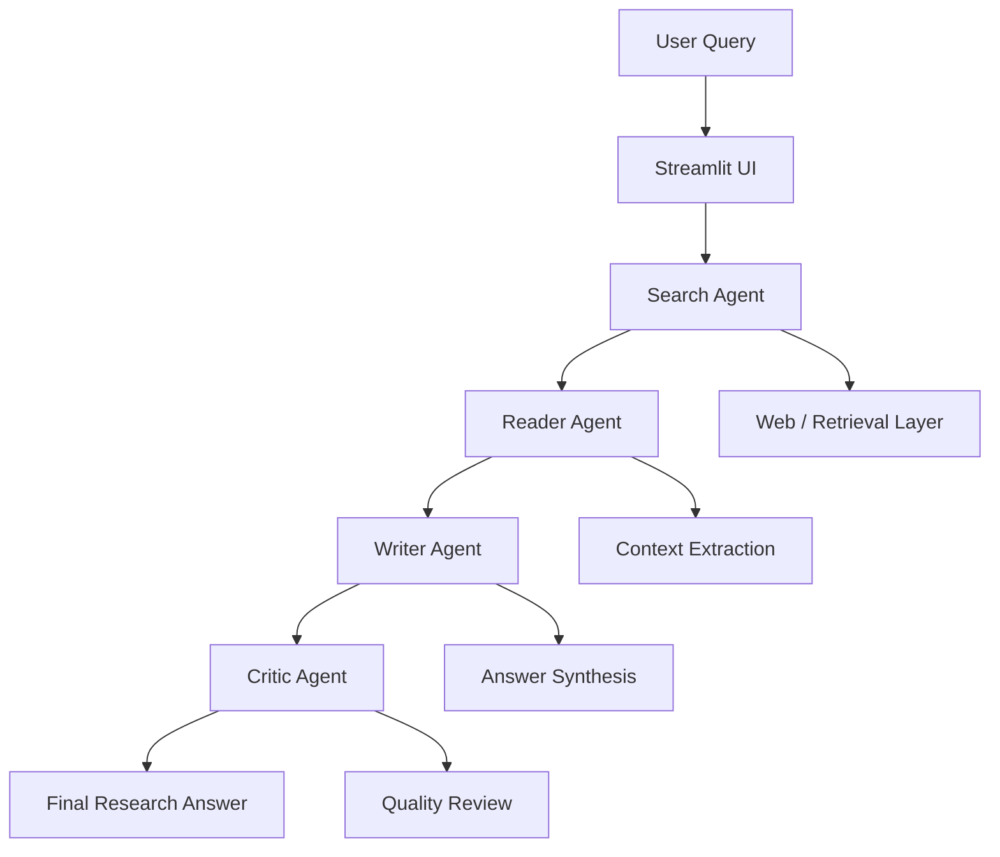

# Langchain Multi-Agent Research System

<p align="center">
  
</p>

<p align="center">
  
  
  
  
  
</p>

A multi-agent research assistant powered by LangChain and Streamlit. It automates the full research workflow: searching, reading, synthesizing, and critically reviewing information before producing a final answer.

This project is built around a team-of-agents pattern where each agent is responsible for a specialized part of the research process.

## Why this project?

Research tasks are rarely solved by a single prompt. They usually require:
- gathering relevant context
- reading and filtering useful information
- synthesizing findings across multiple sources
- validating quality before presenting a final answer

This project reduces that complexity by distributing the work across multiple AI agents, making the process more structured, scalable, and reliable.

## Key Features

- Multi-agent research orchestration
- Search-driven information gathering
- Reading and summarization layer
- Structured answer generation
- Critique and quality improvement loop
- Streamlit-based interface
- Modular architecture for extension
- Easy environment-based configuration

## Tech Stack

- Python 3.10+
- Streamlit
- LangChain
- OpenAI / Gemini / compatible LLM provider
- `.env` configuration
- Optional retrieval and search tools

## Architecture Overview



### High-level flow

```text
User Query
   |
   v
Streamlit UI (app.py)
   |
   v
Search Agent
   |
   +--> Collects relevant sources
   |
   v
Reader Agent
   |
   +--> Extracts useful facts and summaries
   |
   v
Writer Agent
   |
   +--> Drafts a structured final response
   |
   v
Critic Agent
   |
   +--> Reviews reasoning, quality, and completeness
   |
   v
Final Answer
```

The project is organized into:
- `app.py` → application entry point and UI layer
- `src/agents` → agent definitions and workflow logic
- LangChain chains → orchestration of agent behavior
- environment configuration → API keys and runtime settings

## Project Structure

```text
Langchain-Multi-Agent-Research-System/
├── app.py
├── requirements.txt
├── README.md
├── .gitignore
├── .env.example
├── src/
│   ├── agents/
│   │   ├── agents.py
│   │   └── ...
│   ├── config/
│   │   └── ...
│   ├── utils/
│   │   └── ...
│   └── ...
├── docs/
│   └── ...
├── notebooks/
│   └── ...
└── ...
```

## Demo

<p align="center">
  
</p>

> Replace the placeholder image with a real UI screenshot of your app.

## Prerequisites

Before running the project, make sure you have:
- Python 3.10 or newer
- `pip` installed
- Access to an LLM API key
- Optional search or retrieval API keys depending on your setup

## Installation

### 1. Clone the repository

```bash
git clone https://github.com/your-username/Langchain-Multi-Agent-Research-System.git
cd Langchain-Multi-Agent-Research-System
```

### 2. Create a virtual environment

Using Conda:

```bash
conda create -n langagent python=3.10
conda activate langagent
```

Using venv on macOS/Linux:

```bash
python -m venv .venv
source .venv/bin/activate
```

Using venv on Windows PowerShell:

```powershell
python -m venv .venv
.venv\Scripts\Activate.ps1
```

### 3. Install dependencies

```bash
pip install -r requirements.txt
```

### 4. Set up environment variables

Create a `.env` file in the project root:

```env
OPENAI_API_KEY=your_openai_api_key
GOOGLE_API_KEY=your_google_api_key
TAVILY_API_KEY=your_tavily_api_key
```

If your project uses a different provider or retrieval backend, add the corresponding keys in the same format.

## Running the app

Start the Streamlit app:

```bash
streamlit run app.py
```

Then open the local URL shown in the terminal in your browser.

## How it works

1. The user enters a research question.
2. The search agent gathers relevant sources or context.
3. The reader agent extracts the most useful facts and insights.
4. The writer agent drafts a final, structured response.
5. The critic agent reviews the answer for clarity, completeness, and quality.
6. The final response is returned to the user.

## Example Use Cases

- Academic research
- Technical analysis
- Trend and market research
- Competitive intelligence
- Knowledge synthesis
- Multi-source Q&A workflows

## Customization

This project is easy to extend. You can:
- swap the LLM provider
- add more specialized agents
- replace the search backend
- add vector DB / memory support
- improve the critic workflow for stricter validation

## Contributing

Contributions are welcome.

1. Fork the repository
2. Create a feature branch
3. Make your changes
4. Commit and push
5. Open a pull request

## Roadmap

Planned improvements include:
- multi-source retrieval
- memory and state persistence
- better summarization quality metrics
- exportable reports
- more agent specialization for deeper research workflows

## License

This project currently does not include a license file. If you plan to publish it publicly, add an open-source license such as MIT before release.

## Acknowledgements

- LangChain
- Streamlit
- OpenAI ecosystem
- Open-source AI community

## Contact

For questions, feedback, or collaboration opportunities, please open an issue in the repository or contact the project maintainer.